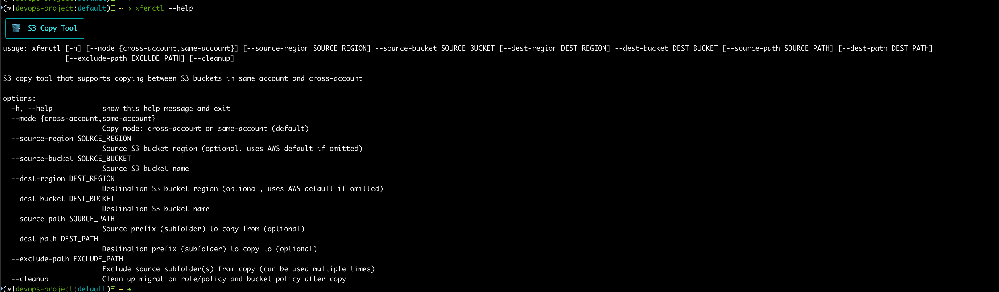

# xferctl

xferctl is an open-source CLI tool designed for seamless file transfers between AWS S3 buckets, supporting both same-account and cross-account operations. Built for reliability, extensibility, and community-driven development, xferctl aims to simplify cloud storage workflows for DevOps, data engineers, and cloud architects.

## Features

- **AWS S3 Support:** Copy files and folders within the same AWS account or across different accounts.
- **Cross-Account Transfers:** Securely handle cross-account authentication and permissions.
- **CLI Simplicity:** Easy-to-use command line interface for quick operations.
- **Extensible Design:** Built for future support of other cloud providers and storage backends.
- **Open Source & Apache-2.0 Licensed:** Contributions welcome from the global community.

## Getting Started

### Prerequisites
- Python 3.8+
- AWS credentials (via user interactive input)

### Installation

Clone the repository:

```bash
git clone https://github.com/Cloudopsshell/xferctl.git
cd xferctl
```

Install dependencies:

```bash
pip install -r requirements.txt
```

### Usage

See `--help` for all options.



Basic S3 copy (same account):

```bash
xferctl --mode same-account --source-bucket <source> --dest-bucket <dest>
```

Cross-account copy:

```bash
xferctl --mode cross-account --source-region <source-region> --source-bucket <source> --dest-region <dest-region> --dest-bucket <dest>
```

Example cross-account copy:

```bash
xferctl --mode cross-account --source-region eu-north-1 --source-bucket cloudopsshell-source-bucket --dest-region eu-west-1 --dest-bucket cloudopsshell-destination-bucket
```


Clean-up:

```bash
xferctl --mode cross-account --source-region eu-north-1 --source-bucket cloudopsshell-source-bucket --dest-region eu-west-1 --dest-bucket cloudopsshell-destination-bucket --cleanup
```


## Contributing

xferctl is community-first! We encourage contributions, feature requests, and bug reports. Please:

1. Fork the repo and create your branch.
2. Submit a pull request with clear description.
3. Follow the [Apache-2.0 License](LICENSE).

### Roadmap
- Multi-cloud support (GCP, Azure, etc.)
- Advanced transfer options (sync, batch, filters)
- GUI and API integrations

## License

Apache-2.0. See [LICENSE](LICENSE) for details.

## Community & Support

- Join discussions and share ideas in GitHub Issues.
- Help shape the roadmap and features.

---

*Built by Cloudopsshell. Developed by the community.*

